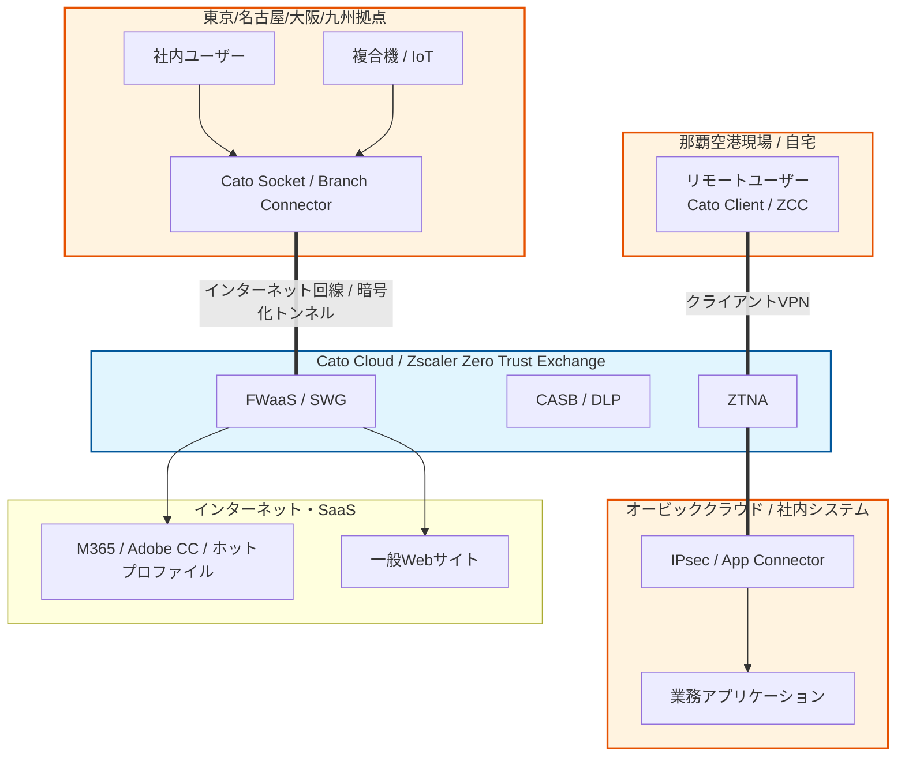

```mermaid
graph TD
    subgraph sase [Cato Cloud / Zscaler Zero Trust Exchange]
        FWaaS[FWaaS / SWG]
        CASB[CASB / DLP]
        ZTNA[ZTNA]
    end

    subgraph branch [東京/名古屋/大阪/九州拠点]
        Edge[Cato Socket / Branch Connector]
        Users[社内ユーザー]
        Devices[複合機 / IoT]
        Users --> Edge
        Devices --> Edge
    end

    subgraph remote [那覇空港現場 / 自宅]
        RemoteUser[リモートユーザー<br>Cato Client / ZCC]
    end

    subgraph datacenter [オービッククラウド / 社内システム]
        App[業務アプリケーション]
        Connector[IPsec / App Connector]
        Connector --> App
    end

    subgraph internet [インターネット・SaaS]
        SaaS[M365 / Adobe CC / ホットプロファイル]
        Web[一般Webサイト]
    end

    Edge == インターネット回線 / 暗号化トンネル === FWaaS
    RemoteUser == クライアントVPN === ZTNA
    FWaaS --> SaaS
    FWaaS --> Web
    ZTNA === Connector
    
    classDef cloud_style fill:#e1f5fe,stroke:#01579b,stroke-width:2px;
    classDef premise_style fill:#fff3e0,stroke:#e65100,stroke-width:2px;
    
    class sase cloud_style;
    class branch,remote,datacenter premise_style;
```
